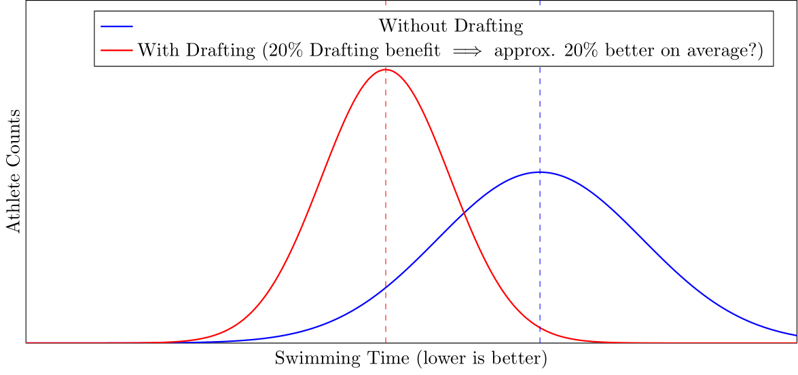

# ow-drafting-fx-event-study-estim

Using COVID-19 **non-drafting** response policies (2020–2022) to estimate the magnitude of swim drafting benefits (~20% improvement in outcomes according to sports literature).

## Research Questions

1. Does the literature's ~20% drafting benefit $\implies$ 20% better mean outcomes for drafters in drafting races?

2. Optional control for drafting groups/robustness: Calculation of an event-specific clustering-based DraftingGroupCriteria (based on "Out"-Times).
3. Effect heterogeneity: Which groups (e.g., percentiles) benefit the most from drafting? Estimate marginal effects.

## Research Design (Draft, Event-Study, Staggered-DiD Approach)

### Event-Study Model with Three Periods:

$$
Y_{it} = \gamma_0 + \gamma_1 \mathbf{1}\{t \in \text{covid}\} + \gamma_2 \mathbf{1}\{t \in \text{postcovid}\} + \gamma_3 X_{i} + \gamma_4 \mathbf{1}\{i \in \text{leader}\} + \gamma_5 \mathbf{1}\{t \in \text{covid}\} \cdot \mathbf{1}\{i \in \text{drafter}\} + \gamma_6 \mathbf{1}\{t \in \text{postcovid}\} \cdot \mathbf{1}\{i \in \text{drafter}\} + \mu_i + \nu_j + \delta_t + \theta_t \text{trend} + \varepsilon_{it}
$$

Where:

- $Y_{it}$: outcome of athlete $i$ at time $t$.
- $\gamma_0$: intercept term.
- $\mathbf{1}\{t \in \text{covid}\}$: indicator for the COVID period (2020–2022) when drafting was not allowed.
- $\mathbf{1}\{t \in \text{postcovid}\}$: indicator for the post-COVID period (after 2022) when drafting restrictions were lifted.
- $X_i$: additional covariates for athlete $i$.
- $\mathbf{1}\{i \in \text{leader}\}$: indicator for athletes who are the fastest in their cluster (leaders who do not benefit from drafting).
- $\mathbf{1}\{i \in \text{drafter}\}$: indicator for athletes who are eligible to draft.
- $\gamma_5$: interaction effect of the COVID period and drafting eligibility for drafters.
- $\gamma_6$: interaction effect of the post-COVID period and drafting eligibility for drafters.
- $\mu_i$: Athlete fixed effects (FEs).
- $\nu_j$: Event and event-type fixed effects (FEs).
- $\delta_t$: Month FEs (seasonality, weather, etc.).
- $\theta_t \text{trend}$: time trend to capture long-term performance improvements.
- $\varepsilon_{it}$: error term.

### Structural Break Test / Parallel Trends Assumption (PTA):

### Endogeneity:

### Three Periods:

1. **Pre-COVID (Baseline)**: No restrictions on drafting, this serves as the baseline period (no indicator is needed).
2. **COVID Non-Drafting (2020–2022)**: No drafting allowed, represented by $\mathbf{1}\{t \in \text{covid}\}$.
3. **Post-COVID (Post-2022)**: No restrictions on drafting, represented by $\mathbf{1}\{t \in \text{postcovid}\}$.

### DraftingGroupCriteria

The **DraftingGroupCriteria** is based on hierarchical clustering of swim times, which is used to define drafting groups:

1. **Swim Times ($T_i$)**: Let $T_i$ represent the swim time for athlete $i$. All athletes in an event are clustered based on their times.
   
2. **Clustering**: Using hierarchical clustering, athletes are grouped based on the proximity of their swim times, forming a cluster $C_k$ for each group $k$. The optimal choice of $k$ for each event $j$ will depend on the distribution of swim times. (->measure open)

$$
C_k = \{ i \mid d(T_i, T_{i'}) \leq d_{\text{threshold}}, \forall i, i' \in C_k \}
$$

Where:
- $C_k$ is the set of athletes in cluster $k$.
- $d(T_i, T_{i'})$ is a distance metric between the swim times $T_i$ and $T_{i'}$.
- $d_{\text{threshold}}$ is a pre-defined threshold that determines the proximity needed to form a cluster (->literature).

3. **Leader and Drafters**:
   - The athlete with the fastest time in the cluster,

$$ 
L_k = \underset{i \in C_k}{\arg \min} \, T_i 
$$

is assigned to **Leader**.

   - All other athletes in the cluster are assigned as **Potential Drafters**:
   
$$ 
D_k = C_k \setminus \{L_k\} 
$$

The leader $L_k$ cannot draft, but the potential drafters $D_k$ are considered to benefit from drafting effects within their respective cluster.

## Data Requirements

1. Swim outcome times from multiple events, from different event types on multiple athletes across 2 drafting and 1 non-drafting periods.
2. COVID-19 policy period indicators (e.g., event-specific restrictions on drafting).
3. Athlete information (ID, performance history).
4. Event data (group starts, waves, etc.).
5. Fixed effect controls: athlete FEs, event FEs, and seasonality FEs.

## Estimated Effects

